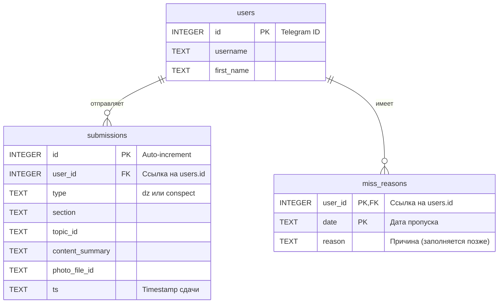
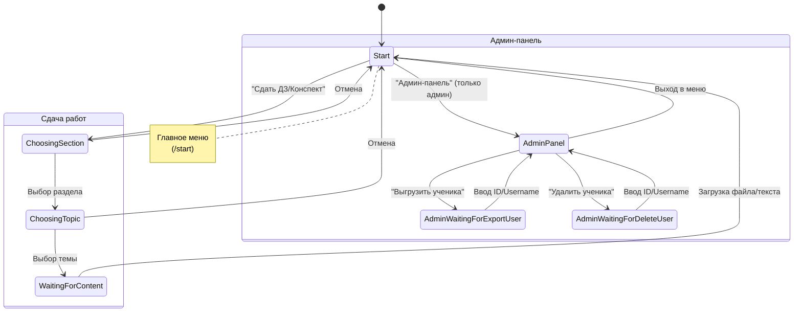

# Документация Telegram-бота LMS (Learning Management System)

Данный документ описывает архитектуру, функциональность и структуру базы данных бота, разработанного на **Rust** для автоматизации сдачи домашних заданий (ДЗ) и конспектов, а также отслеживания прогресса учеников.

> [!INFO] 
> **Общее описание**
> Бот выступает в роли платформы для сдачи работ. Он поддерживает прием текста, фото и документов, группирует медиа-альбомы, генерирует Excel-отчеты для администратора и строит графики успеваемости.

---

## Технический стек

Проект реализован на языке **Rust** с использованием асинхронного рантайма Tokio.

| Компонент | Библиотека | Назначение |
| :--- | :--- | :--- |
| **Telegram API** | `teloxide` | Взаимодействие с API Telegram, обработка FSM (диалогов). |
| **Database** | `sqlx` (SQLite) | Асинхронная работа с БД, миграции, пулинг соединений. |
| **Reports** | `rust_xlsxwriter` | Генерация отчетов в формате `.xlsx`. |
| **Charts** | `plotters` | Рисование графиков (PNG) для аналитики. |
| **Scheduling** | `tokio-cron-scheduler` | Запуск периодических задач (напоминания, отчеты). |
| **Files** | `zip`, `walkdir` | Архивирование данных пользователя. |

---

## Структура Базы Данных

Используется **SQLite**. База данных инициализируется автоматически при старте (`init_db`).

> [!IMPORTANT]
> **Важно**
> Для корректной работы требуется переменная окружения `DATABASE_URL` (по умолчанию `sqlite:bot.db`). Бот автоматически создает файл БД, если он отсутствует.

### Схема таблиц



---

## Логика диалогов (FSM)

Бот использует конечный автомат (Finite State Machine) через `teloxide::dispatching::dialogue`.



> [!INFO]
> **Обработка альбомов (Media Groups)**
> Telegram отправляет фото альбома как отдельные сообщения. Бот использует `DashMap` и фоновую задачу (cron раз в 0.5 сек), чтобы "склеивать" сообщения с одинаковым `media_group_id` в одну сущность (submission) перед записью в БД.

---

##  Конфигурация

Для запуска приложения необходимо настроить `.env` файл в корне проекта:

```dotenv
API_TOKEN=your_telegram_bot_token
ADMIN_ID=123456789             # ID администратора (доступ к панели)
DATABASE_URL=sqlite:bot.db     # Путь к БД
CONSPECTS_DIR=conspects        # Папка для локального сохранения файлов
```

## Запуск

```shell
git clone https://github.com/golkity/cs-ege-bot.git
```

```shell
make run
```

---
by Finnik